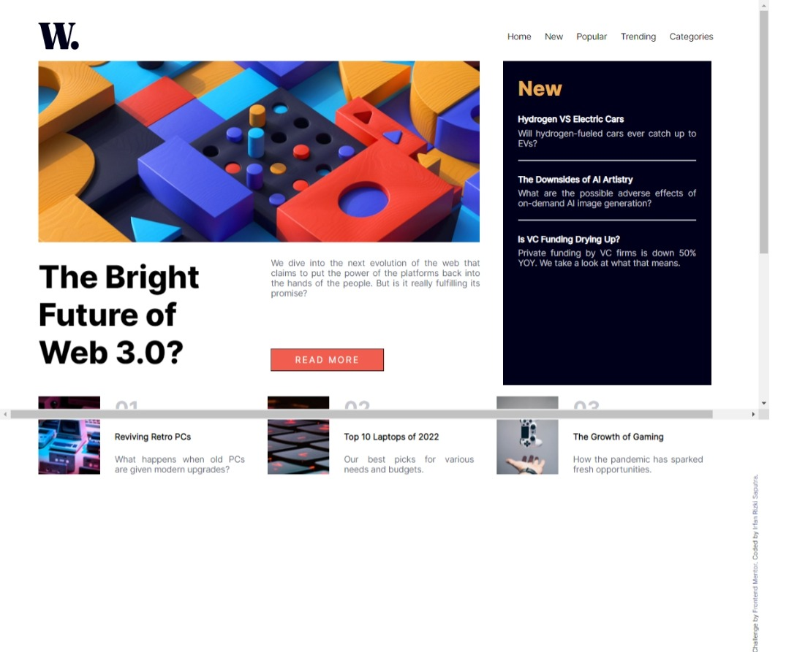
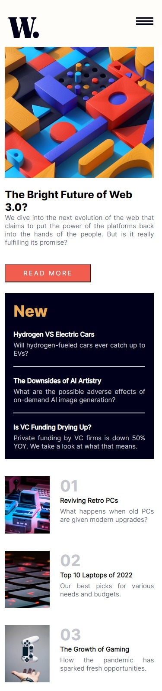

# Frontend Mentor - News homepage solution

This is a solution to the [News homepage challenge on Frontend Mentor](https://www.frontendmentor.io/challenges/news-homepage-H6SWTa1MFl). Frontend Mentor challenges help you improve your coding skills by building realistic projects. 

## Table of contents

- [Overview](#overview)
  - [The challenge](#the-challenge)
  - [Screenshot](#screenshot)
  - [Links](#links)
- [My process](#my-process)
  - [Built with](#built-with)
  - [What I learned](#what-i-learned)
  - [Continued development](#continued-development)
  - [Useful resources](#useful-resources)
- [Author](#author)

**Note: Delete this note and update the table of contents based on what sections you keep.**

## Overview

### The challenge

Users should be able to:

- View the optimal layout for the interface depending on their device's screen size
- See hover and focus states for all interactive elements on the page

### Screenshot




### Links

- Solution URL: [Github Repository](https://github.com/nafri97/news-homepage)
- Live Site URL: [Add live site URL here](https://nafri97.github.io/news-homepage)

## My process

### Built with

- Semantic HTML5 markup
- CSS custom properties
- Flexbox
- Javacript

### What I learned

I am just newbie in javascript, so much javascript syntax just I learned.
here is some code snippets:

```js
    const categoriesBtn = document.querySelector('.cats > a');
    const dropdown = document.querySelector('.dropdown');
    let clickCount = 0;
    categoriesBtn.addEventListener('click', () => {
    clickCount++;
    if (clickCount % 2 !== 0) {
        dropdown.style.display = 'block';
    } else {
        dropdown.style.display = 'none';
    }
    });
```
from code above display of `dropdown` is based of odd even of `categoriesBtn` click.

### Continued development

I will learn more about Javascript.


### Useful resources

- [w3school](https://www.w3school.com)
- [chatGPT](https://www.chat.openai.com) 

## Author

- Linkedin - [](https://linkedin.com/in/nafri97)
- Frontend Mentor - [@nafri97](https://www.frontendmentor.io/profile/nafri97)
- Twitter - [@irfanrizkis](https://www.twitter.com/irfanrizkis)
